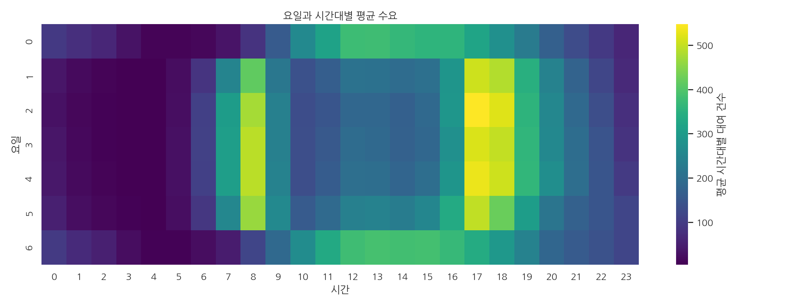
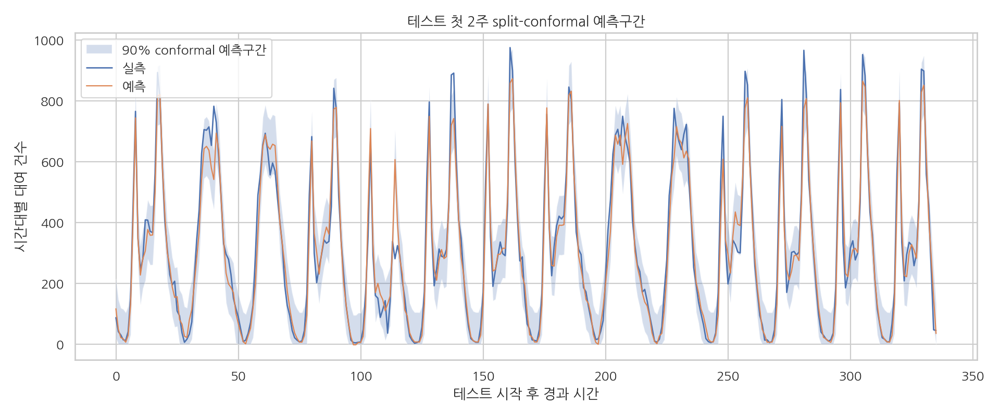
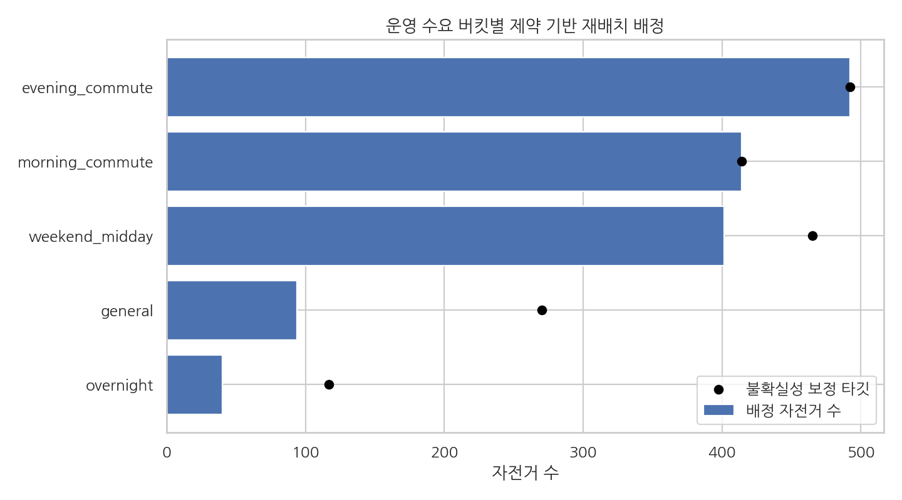

# 따릉이 수요 회복력 예측 연구

시간대별 공공자전거 수요를 예측하고, 출퇴근 피크·악천후·주말 수요 구간에서 모델이 얼마나 안정적으로 작동하는지 검증한 연구형 데이터 사이언스 포트폴리오입니다. 단순 예측 점수보다 운영 의사결정에 필요한 기준선 비교, 시간순 검증, 예측구간, 구간별 오차 감사, 제약 기반 재배치 데모를 한 pipeline으로 묶었습니다.

## 핵심 결과

최근 재현 실행 기준:

| 항목 | 값 |
|---|---:|
| 데이터 | UCI Bike Sharing Dataset, 17,379행 |
| 선택 모델 | `gradient_boosting` |
| 테스트 MAE | 35.95건 |
| 테스트 WAPE | 15.36% |
| 테스트 R2 | 0.933 |
| Bootstrap MAE 95% CI | [34.31, 37.61] |
| Split-conformal 90% coverage | 92.3% |

해석상 중요한 지점:

- `historical_profile_median`, `ridge_regression`, `gradient_boosting`을 같은 시간순 holdout에서 비교했습니다.
- `lag_1`, `hr`, `is_commute_peak`, `lag_24`, `lag_168`이 테스트 구간 순열 중요도 상위 feature였습니다.
- 출퇴근 피크는 전체 평균보다 MAE가 높아 별도 운영 risk segment로 관리해야 합니다.
- 악천후 시나리오는 관측 조건 대비 평균 예측 수요를 약 17% 낮추는 방향으로 나타났습니다.
- 예측값과 conformal 반경을 수요 버킷별 staging target으로 변환해 fleet budget 제약 최적화까지 연결했습니다.

## 대표 시각화

| 수요 패턴 | 예측 불확실성 | 재배치 의사결정 |
|---|---|---|
|  |  |  |

## 연구 질문

1. 시간순 분할을 보존했을 때 공공자전거 시간대별 수요를 어느 수준까지 예측할 수 있는가?
2. 전체 평균 성능이 아니라 출퇴근·주말·악천후 구간에서 어떤 실패 패턴이 나타나는가?
3. point forecast를 운영자가 검토 가능한 불확실성 구간과 재배치 target으로 변환할 수 있는가?

## 방법론

| 단계 | 설계 |
|---|---|
| 데이터 계약 | UCI 원천 zip 다운로드, raw CSV 보존, source metadata와 data dictionary 생성 |
| 피처 엔지니어링 | 달력, 시간대, 출퇴근 window, 악천후 flag, `temp_x_hum`, 1/24/168시간 lag, shift된 rolling mean |
| 분할 | 시간순 train/valid/test 분할. 랜덤 분할 금지 |
| 기준선 | 근무일 여부와 시간대별 중앙값 profile |
| 모델 | Ridge regression, Gradient Boosting Regressor |
| 검증 | holdout metrics, `TimeSeriesSplit`, bootstrap MAE CI, split-conformal coverage |
| 해석 | residual segment audit, permutation importance, weather shock scenario |
| 의사결정 | conformal radius를 반영한 demand bucket staging target과 linear programming allocation |

## Repo 구조

```text
.
├── README.md
├── docs/
│   ├── data_contract.md
│   ├── modeling_protocol.md
│   ├── portfolio_review.md
│   └── reproducibility.md
├── scripts/
│   └── run_all.sh
├── src/bike_share_resilience/
│   ├── __init__.py
│   └── pipeline.py
├── tests/
│   ├── conftest.py
│   └── test_pipeline.py
├── pyproject.toml
└── requirements.txt
```

대용량 데이터, 모델 pickle, 그림, 보고서 산출물은 Git에 넣지 않고 `/DATA/HJ/prj/data-scientist-career/projects/bike-share-demand-resilience`에 생성합니다.

## 실행 방법

```bash
cd /workspace/prj/data-scientist-career/bike-share-demand-resilience
python3 -m venv .venv
. .venv/bin/activate
pip install -r requirements.txt
scripts/run_all.sh
```

테스트만 실행:

```bash
cd /workspace/prj/data-scientist-career/bike-share-demand-resilience
PYTHONPATH=src python3 -m pytest tests -q
```

pipeline 직접 실행:

```bash
PYTHONPATH=src python3 -m bike_share_resilience.pipeline \
  --output-root /DATA/HJ/prj/data-scientist-career/projects/bike-share-demand-resilience \
  --report-dir /DATA/HJ/prj/data-scientist-career/reports
```

## 주요 산출물

| 산출물 | 경로 |
|---|---|
| 최종 보고서 | `/DATA/HJ/prj/data-scientist-career/projects/bike-share-demand-resilience/reports/final_report.md` |
| 모델 카드 | `/DATA/HJ/prj/data-scientist-career/projects/bike-share-demand-resilience/reports/model_card.md` |
| 데이터 계약 | `/DATA/HJ/prj/data-scientist-career/projects/bike-share-demand-resilience/reports/data_source_and_contract.md` |
| 모델 지표 | `/DATA/HJ/prj/data-scientist-career/projects/bike-share-demand-resilience/reports/model_metrics.csv` |
| 실험 추적기 | `/DATA/HJ/prj/data-scientist-career/projects/bike-share-demand-resilience/reports/experiment_tracker.csv` |
| 예측구간 | `/DATA/HJ/prj/data-scientist-career/projects/bike-share-demand-resilience/reports/conformal_prediction_intervals.csv` |
| 재배치 데모 | `/DATA/HJ/prj/data-scientist-career/projects/bike-share-demand-resilience/reports/rebalancing_optimization.csv` |
| 그림 | `/DATA/HJ/prj/data-scientist-career/projects/bike-share-demand-resilience/figures/` |

## 한계

- UCI 데이터는 시스템 집계 자료라 정류장 좌표, dock capacity, 장애·점검, 이벤트, 요금 정보를 포함하지 않습니다.
- 날씨 충격 분석은 인과 추정이 아니라 모델 기반 민감도 분석입니다.
- 재배치 최적화는 실제 dispatch 정책이 아니라 station-level 데이터가 없을 때 가능한 구조적 데모입니다.
- 실서비스 전환 전에는 station-level spatial feature, capacity constraint, prospective validation, drift monitoring이 필요합니다.

## 면접에서 설명할 포인트

- 랜덤 split 대신 시간순 split을 쓴 이유와 누수 차단 방식
- baseline을 두고 nonlinear model을 비교한 이유
- MAPE만 보지 않고 WAPE/sMAPE/MAE CI를 함께 보고한 이유
- conformal interval을 운영 의사결정의 보수성 기준으로 연결한 방식
- 공개 데이터의 한계를 인정하고 station-level 확장 설계를 분리한 점
