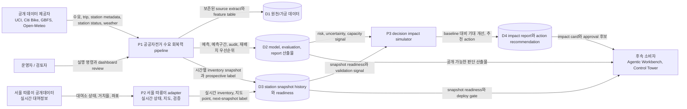
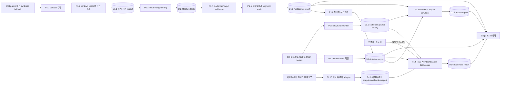

# 데이터 흐름도(DFD)

최종 업데이트: 2026-07-15 KST

## 범위

이 문서는 `bike-share-demand-resilience`의 현재 데이터 흐름과 확정된 target architecture를 설명한다. 현재 구현은 UCI/Citi Bike benchmark를 기준으로 하되, 서울 따릉이 공개데이터 adapter를 통해 실시간 대여소 상태, 지도 기반 우선순위, next-snapshot label, rule/model 검증 readiness까지 연결한다. 최종 방향은 decision impact simulator를 붙여 한국 공공자전거 운영 의사결정 제품으로 확장하는 것이다.

이 프로젝트는 두 개의 연결된 surface를 가진다.

- 시스템 단위 수요 예측과 재배치 판단 산출물.
- Station 단위 live inventory snapshot monitoring과 prospective shortage validation.
- 서울 따릉이 대여소 상태를 읽고 지도/API/dashboard로 내보내는 adapter boundary.
- 대여 불가/반납 포화/재배치 우선순위의 impact simulation.

## 0단계 컨텍스트

## 1단계 논리 흐름

## 데이터 저장소

| 저장소 | 내용 | 생산자 | 소비자 |
|---|---|---|---|
| D1.1 공개 원천 extract | UCI/public demand data, station/trip/status/weather extract, offline smoke용 synthetic data | dataset 수집 | contract check, feature engineering |
| D1.2 feature table | leakage-safe 시간 feature, station-hour demand frame, station/weather join feature | feature engineering과 station 확장 | model training과 validation |
| D1.3 model/eval report | Baseline/Ridge/Gradient Boosting score, holdout metric, bootstrap CI, conformal coverage, segment audit | model/eval pipeline | 재배치, Stage 2/3 |
| D1.4 station report | station-level model 결과, shortage risk ranking, station profile summary | station-level 확장 | dashboard, Stage 2/3 |
| D1.5 station snapshot history | 시간별 `station_status` snapshot, inventory state, prospective next-snapshot label | snapshot monitor | prospective validation과 readiness check |
| D1.6 readiness report | snapshot readiness, public deploy readiness, prospective validation 상태 | snapshot monitor와 deploy checker | 운영자, Control Tower |
| D1.7 impact report | baseline policy 대비 model policy의 shortage/overflow 감소, false alarm cost, 추천 action | decision impact simulator | Stage 2 agent, Control Tower impact card |
| D1.8 서울 따릉이 snapshot/validation report | 실시간 inventory, map points, 재배치 우선순위, next-snapshot label, rule/model metric | 서울 따릉이 adapter와 validation runner | dashboard, API, deploy gate |

## 흐름 목록

| 흐름 | 출발 | 도착 | 데이터 | 검증 또는 gate |
|---|---|---|---|---|
| F1 | 공개 데이터 제공자 | dataset 수집 | demand, station metadata/status, trip, weather | source contract와 row-count check |
| F2 | 원천 extract | feature pipeline | time-aware feature와 station join | leakage-safe time split |
| F3 | feature table | model training | train/holdout data | baseline 비교와 metric report |
| F4 | model output | uncertainty/audit | prediction, residual, segment | bootstrap CI, conformal coverage, segment residual audit |
| F5 | forecast/eval report | 재배치 우선순위 | 예측 수요와 불확실성 | 우선순위는 advisory output이며 자동 dispatch 아님 |
| F6 | live GBFS status | snapshot monitor | station/timestamp별 inventory | 2주 readiness까지 시간별 snapshot 축적 |
| F7 | snapshot history | prospective validation | next-snapshot shortage label | cutoff로 동결한 340개 cohort와 time-based split 검증 |
| F8 | report/readiness | local API/dashboard | station risk와 readiness summary | upstream evidence gate와 endpoint deploy gate 분리 |
| F9 | Stage 1 산출물 | Stage 2/3 | 공개 가능한 판단 근거 | downstream system은 `GO`, `NO_GO`, blocker를 원형 보존 |
| F10 | 서울 따릉이 공개데이터 | 서울 adapter | 실시간 대여소 상태, 거치율, 좌표 | API rate/row-count/source contract check |
| F10a | 서울 snapshot history | 서울 validation runner | `bike_shortage_next_snapshot`, `dock_shortage_next_snapshot`, global/balanced rule precision@10/50, ML readiness | 2026-07-15 KST 기준 302 snapshots로 validation/model `READY`; global metric은 `remove_bikes` 중심이고 balanced action metric이 send/remove를 분리 검증 |
| F11 | model/eval/snapshot 산출물 | decision impact simulator | risk, uncertainty, inventory, capacity, readiness | baseline policy와 model policy를 같은 제약에서 비교 |
| F12 | impact report | Stage 2/3 | 추천 action, 기대 shortage/overflow 감소, confidence, blocker | low-impact 또는 weak-evidence action은 review/refusal |

## 신뢰/안전 경계

| 경계 | 규칙 |
|---|---|
| source 경계 | 외부 원천 데이터는 read-only로 다루며 `OUTPUT_ROOT` 아래 보존하고 Git에는 넣지 않는다. |
| 시간 검증 경계 | 예측은 time-aware split을 사용하며 random split leakage는 배포 근거로 인정하지 않는다. |
| live label 경계 | GBFS `station_status`는 현재 상태이며, 충분한 snapshot 전까지 성숙한 historical target이 아니다. |
| action 경계 | 재배치 우선순위는 decision support artifact이며 현장 작업을 직접 dispatch하지 않는다. |
| public deploy 경계 | Station readiness와 prospective validation은 upstream evidence gate를 결정한다. 외부 endpoint 배포는 auth와 운영 정책을 별도 확인한다. |
| adapter 경계 | 도시별 데이터 차이는 adapter에서 흡수하고, 후속 feature/eval/decision simulator는 공통 contract만 읽는다. |
| impact claim 경계 | 서울 따릉이 next-snapshot validation과 balanced action metric은 `READY`지만, decision impact simulator 전에는 재배치 운영 성과로 claim하지 않는다. |

## 현재 운영 상태

- Snapshot monitor는 매시 실행되도록 예약되어 있다.
- Frozen station cohort는 340개 snapshot과 14.01일 coverage로 prospective validation `PASS`다.
- Local API/dashboard는 검토용으로 사용할 수 있고, upstream evidence gate는 `GO`다. 외부 endpoint는 별도 deployment gate를 따른다.
- 서울 따릉이 adapter는 실시간 snapshot, 지도 point, priority, next-snapshot validation까지 구현되어 있고, 2026-07-15 KST 기준 validation/model이 `READY`다.
- Global top-K의 `remove_bikes` 편향은 balanced action metric으로 보조 검증했고, 확정된 다음 방향은 decision impact simulator 추가다.
